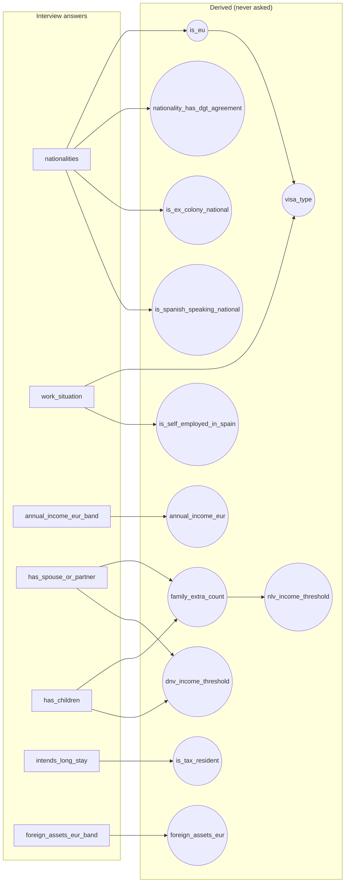

# The Camino catalog — obligations × the questions that gate them

> **Generated** by `npm run docs:catalog` on 2026-07-03 — do not hand-edit; regenerate after any
> catalog or interview change. This is the human-reviewable view of the deterministic core:
> which interview answers exist, what gets derived from them, and exactly which combination
> switches each obligation on.

**Totals:** 60 obligations · 19 interview questions · 12 derivations.

## 1 · The interview (every question asked)

| # | Field | Type | Asked when | Hint (what Lola asks about) |
|---|---|---|---|---|
| 1 | `nationalities` | list | always | what passport(s) everyone in the household holds |
| 2 | `work_situation` | list | always | their work situation when they move — remote employee, freelancer, retired, studying, etc. |
| 3 | `employer_country_is_foreign` | bool | work_situation = "employed_remote" | whether their employer is based outside Spain (vs a Spanish company hiring them) |
| 4 | `annual_income_eur_band` | band | is_eu = false | their rough annual household income in euros — determines which visa they qualify for |
| 5 | `has_spouse_or_partner` | bool | always | whether a spouse or partner will be relocating with them |
| 6 | `partner_is_married` | bool | has_spouse_or_partner = true | whether they are legally married or in a registered civil partnership |
| 7 | `has_children` | bool | always | whether school-age children will be making this move |
| 8 | `intends_long_stay` | bool | always | whether this is a long-term move (more than 183 days a year) or a shorter extended stay |
| 9 | `arrival_date` | date | always | roughly when they plan to arrive in Spain — even an approximate month is enough to anchor real deadlines |
| 10 | `has_spanish_address` | bool | always | whether they already have a Spanish address — rented or owned |
| 11 | `owns_or_drives` | bool | always | whether anyone in the household will drive in Spain |
| 12 | `owns_property_in_spain` | bool | always | whether they own or are actively planning to purchase property in Spain |
| 13 | `property_purchase` | date | owns_property_in_spain = true | roughly when they completed (or expect to complete) the property purchase — anchors the notary, registry, and … |
| 14 | `knows_where_to_live` | bool | NOT owns_property_in_spain = true | whether they already know which city or region in Spain they'll settle in, or are still deciding where to live |
| 15 | `has_pets` | bool | always | whether any pets — dogs, cats, or ferrets — will be making this move with them |
| 16 | `foreign_assets_eur_band` | band | is_tax_resident = true | roughly, total assets held outside Spain — only a range is needed, drives Modelo 720 |
| 17 | `us_resident` | bool | is_eu = false | whether they are currently based in the US — affects consulate and wait times |
| 18 | `previously_ex_spanish_colony_nationality` | bool | is_eu = false | whether they hold nationality from a former Spanish colony (most Latin American countries, Philippines) — this… |
| 19 | `wants_citizenship` | bool | is_eu = false AND intends_long_stay = true | whether, longer term, they hope to become a Spanish citizen — or plan to just keep renewing their residence to… |

## 2 · Derivations (fields computed, never asked)

| Derived field | Computed from |
|---|---|
| `is_eu` | `nationalities` |
| `nationality_has_dgt_agreement` | `nationalities` |
| `is_ex_colony_national` | `nationalities` |
| `is_spanish_speaking_national` | `nationalities` |
| `is_tax_resident` | `intends_long_stay` |
| `foreign_assets_eur` | `foreign_assets_eur_band` |
| `annual_income_eur` | `annual_income_eur_band` |
| `family_extra_count` | `has_spouse_or_partner`, `has_children` |
| `nlv_income_threshold` | `family_extra_count` |
| `dnv_income_threshold` | `has_spouse_or_partner`, `has_children` |
| `visa_type` | `is_eu`, `work_situation` |
| `is_self_employed_in_spain` | `work_situation` |

## 3 · The obligations (what applies, when)

| Obligation | Sev | Source | Applies when | Depends on | Timing |
|---|---|---|---|---|---|
| `scout-where-to-live` | recommended | recommendation | NOT owns_property_in_spain = true AND knows_where_to_live = false | — | -270d before arrival |
| `choose-visa-type` | required | official | is_eu = false | — | -180d before arrival |
| `consulate-appointment` | required | official | is_eu = false | `choose-visa-type` | -150d before arrival |
| `criminal-background-check` | required | official | is_eu = false | `choose-visa-type` | -120d before arrival |
| `medical-certificate` | required | official | is_eu = false | `choose-visa-type` | -45d before arrival |
| `nlv-income-proof` | required | official | visa_type = "nlv" | `choose-visa-type` | -60d before arrival |
| `nlv-health-insurance` | required | official | visa_type = "nlv" | `choose-visa-type` | -45d before arrival |
| `convenio-especial` | recommended | official | visa_type = "nlv" | `nlv-health-insurance` | +365d after residency_established |
| `dnv-remote-work-proof` | required | official | visa_type = "dnv" | `choose-visa-type` | -60d before arrival |
| `dnv-income-proof` | required | official | visa_type = "dnv" | `choose-visa-type` | -60d before arrival |
| `dnv-coverage-certificate` | required | official | visa_type = "dnv" AND work_situation = "employed_remote" | `choose-visa-type` | -60d before arrival |
| `empadronamiento` | required | official | has_spanish_address = true | — | ASAP (window from arrival) |
| `nie` | required | official | is_eu = false | — | +30d after arrival |
| `eu-registration-certificate` | required | official | is_eu = true AND intends_long_stay = true | — | +90d after arrival |
| `residencia` | required | official | is_eu = false | `empadronamiento` `nie` | +0d after `nie` |
| `tarjeta-sanitaria` | required | official | has_spanish_address = true AND NOT visa_type = "nlv" | `empadronamiento` | +14d after `empadronamiento` |
| `exit-tax-return` | recommended | recommendation | is_tax_resident = true | — | -30d before arrival |
| `modelo-720` | penalty | official | is_tax_resident = true AND foreign_assets_eur gt 50000 | — | yearly (months: 1,2,3) |
| `dgt-exchange` | required | official | owns_or_drives = true AND nationality_has_dgt_agreement = true | `residencia` | +183d after residency_established |
| `dgt-exam` | required | official | owns_or_drives = true AND NOT nationality_has_dgt_agreement = true | `residencia` | +183d after residency_established |
| `escolarizacion` | required | official | has_children = true | `empadronamiento` | +7d after `empadronamiento` |
| `family-reunification` | required | official | is_eu = false AND has_spouse_or_partner = true AND partner_is_married = true | `residencia` | +365d after residency_established |
| `citizenship-track-standard` | info | official | is_eu = false AND wants_citizenship = true AND is_ex_colony_national = false | `residencia` | +3650d after residency_established |
| `citizenship-track-latam` | info | official | wants_citizenship = true AND is_ex_colony_national = true | `residencia` | +730d after residency_established |
| `tax-planning-consultation` | recommended | recommendation | intends_long_stay = true | — | -180d before arrival |
| `apostille-documents` | required | official | is_eu = false | `choose-visa-type` | -90d before arrival |
| `sworn-translation` | required | official | is_eu = false | `apostille-documents` | +7d after `apostille-documents` |
| `nlv-letter-of-intent` | required | official | visa_type = "nlv" | `choose-visa-type` | -90d before arrival |
| `nlv-non-work-declaration` | recommended | official | visa_type = "nlv" AND NOT work_situation in [retired, passive_income] | `choose-visa-type` | -90d before arrival |
| `dnv-qualification-proof` | required | official | visa_type = "dnv" | `choose-visa-type` | -90d before arrival |
| `dnv-company-activity-proof` | required | official | visa_type = "dnv" | `choose-visa-type` | -60d before arrival |
| `dnv-employer-permission-letter` | required | official | visa_type = "dnv" AND work_situation = "employed_remote" | `choose-visa-type` | -60d before arrival |
| `spanish-bank-account` | recommended | recommendation | is_eu = false | `nie` | ASAP (window from arrival) |
| `digital-certificate` | recommended | official | is_tax_resident = true | `nie` | +30d after `nie` |
| `modelo-030` | recommended | official | is_tax_resident = true | `empadronamiento` | +14d after `empadronamiento` |
| `beckham-law` | recommended | official | visa_type = "dnv" AND work_situation = "employed_remote" | `residencia` | +180d after residency_established |
| `modelo-100` | penalty | official | is_tax_resident = true | `residencia` | yearly (months: 4,5,6) |
| `wealth-tax` | penalty | official | is_tax_resident = true AND foreign_assets_eur gt 700000 | `residencia` | yearly (months: 4,5,6) |
| `register-autonomo` | required | official | is_self_employed_in_spain = true | `nie` `residencia` | +30d after residency_established |
| `autonomo-social-security` | penalty | official | is_self_employed_in_spain = true | `register-autonomo` | yearly (months: 12) |
| `modelo-130` | penalty | official | is_self_employed_in_spain = true | `register-autonomo` | yearly (months: 1,4,7,10) |
| `modelo-303` | penalty | official | is_self_employed_in_spain = true | `register-autonomo` | yearly (months: 1,4,7,10) |
| `modelo-390` | penalty | official | is_self_employed_in_spain = true | `modelo-303` | yearly (months: 1) |
| `modelo-200` | penalty | official | work_situation = "business_owner" | `residencia` | yearly (months: 7) |
| `student-visa-health-insurance` | required | official | visa_type = "student" | `choose-visa-type` | -45d before arrival |
| `nlv-renewal` | required | official | visa_type = "nlv" | `residencia` | +305d after residency_established |
| `dnv-renewal` | required | official | visa_type = "dnv" | `residencia` | +1035d after residency_established |
| `permanent-residence` | recommended | official | is_eu = false AND intends_long_stay = true | `residencia` | +1825d after residency_established |
| `property-legal-due-diligence` | recommended | recommendation | owns_property_in_spain = true | `nie` | ASAP (window from arrival) |
| `completion-deed-notary` | required | official | owns_property_in_spain = true | `property-legal-due-diligence` | at property_purchase |
| `land-registry-registration` | recommended | official | owns_property_in_spain = true | `completion-deed-notary` | +30d after property_purchase |
| `property-transfer-tax` | penalty | official | owns_property_in_spain = true | `completion-deed-notary` | +30d after property_purchase |
| `ibi-property-tax` | penalty | official | owns_property_in_spain = true | `completion-deed-notary` | yearly (months: 9,10) |
| `community-fees` | required | official | owns_property_in_spain = true | `completion-deed-notary` | yearly (months: 12) |
| `nonresident-property-tax` | penalty | official | owns_property_in_spain = true AND NOT is_tax_resident = true | `completion-deed-notary` | yearly (months: 12) |
| `pet-import` | required | official | has_pets = true | — | -10d before arrival |
| `dele-a2-exam` | required | official | is_eu = false AND wants_citizenship = true AND is_spanish_speaking_national = false | `residencia` | +1825d after residency_established |
| `ccse-exam` | required | official | is_eu = false AND wants_citizenship = true | `residencia` | +1825d after residency_established |
| `citizenship-application` | required | official | is_eu = false AND wants_citizenship = true | `citizenship-track-standard` `citizenship-track-latam` `ccse-exam` | +3650d after residency_established |
| `citizenship-jura` | required | official | is_eu = false AND wants_citizenship = true | `citizenship-application` | +365d after `citizenship-application` |

## 4 · The branching — which fields gate which obligations

Every field that any `applies_if` tests, and the obligations that hinge on it. This is the
review view: change an answer, these are the items that can appear or disappear.

| Field | Gates (83 references) |
|---|---|
| `is_eu` | `choose-visa-type` · `consulate-appointment` · `criminal-background-check` · `medical-certificate` · `nie` · `eu-registration-certificate` · `residencia` · `family-reunification` · `citizenship-track-standard` · `apostille-documents` · `sworn-translation` · `spanish-bank-account` · `permanent-residence` · `dele-a2-exam` · `ccse-exam` · `citizenship-application` · `citizenship-jura` |
| `visa_type` | `nlv-income-proof` · `nlv-health-insurance` · `convenio-especial` · `dnv-remote-work-proof` · `dnv-income-proof` · `dnv-coverage-certificate` · `tarjeta-sanitaria` · `nlv-letter-of-intent` · `nlv-non-work-declaration` · `dnv-qualification-proof` · `dnv-company-activity-proof` · `dnv-employer-permission-letter` · `beckham-law` · `student-visa-health-insurance` · `nlv-renewal` · `dnv-renewal` |
| `owns_property_in_spain` | `scout-where-to-live` · `property-legal-due-diligence` · `completion-deed-notary` · `land-registry-registration` · `property-transfer-tax` · `ibi-property-tax` · `community-fees` · `nonresident-property-tax` |
| `is_tax_resident` | `exit-tax-return` · `modelo-720` · `digital-certificate` · `modelo-030` · `modelo-100` · `wealth-tax` · `nonresident-property-tax` |
| `wants_citizenship` | `citizenship-track-standard` · `citizenship-track-latam` · `dele-a2-exam` · `ccse-exam` · `citizenship-application` · `citizenship-jura` |
| `work_situation` | `dnv-coverage-certificate` · `nlv-non-work-declaration` · `dnv-employer-permission-letter` · `beckham-law` · `modelo-200` |
| `is_self_employed_in_spain` | `register-autonomo` · `autonomo-social-security` · `modelo-130` · `modelo-303` · `modelo-390` |
| `intends_long_stay` | `eu-registration-certificate` · `tax-planning-consultation` · `permanent-residence` |
| `has_spanish_address` | `empadronamiento` · `tarjeta-sanitaria` |
| `foreign_assets_eur` | `modelo-720` · `wealth-tax` |
| `owns_or_drives` | `dgt-exchange` · `dgt-exam` |
| `nationality_has_dgt_agreement` | `dgt-exchange` · `dgt-exam` |
| `is_ex_colony_national` | `citizenship-track-standard` · `citizenship-track-latam` |
| `knows_where_to_live` | `scout-where-to-live` |
| `has_children` | `escolarizacion` |
| `has_spouse_or_partner` | `family-reunification` |
| `partner_is_married` | `family-reunification` |
| `has_pets` | `pet-import` |
| `is_spanish_speaking_national` | `dele-a2-exam` |

## 5 · Field-flow graph (questions → derived fields)

Obligations hang off these fields per the tables above; drawing all 60 would be
unreadable, so this graph shows how raw answers become the derived switches.

## 6 · Direct-gate fields (asked, used as-is by obligations)

`owns_property_in_spain` · `knows_where_to_live` · `work_situation` · `has_spanish_address` · `intends_long_stay` · `owns_or_drives` · `has_children` · `has_spouse_or_partner` · `partner_is_married` · `wants_citizenship` · `has_pets`
